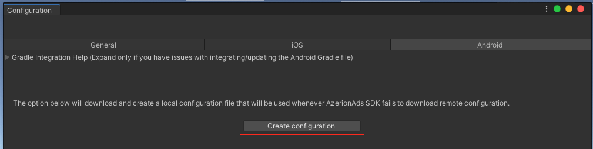
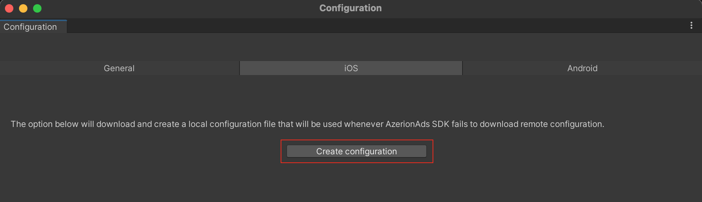
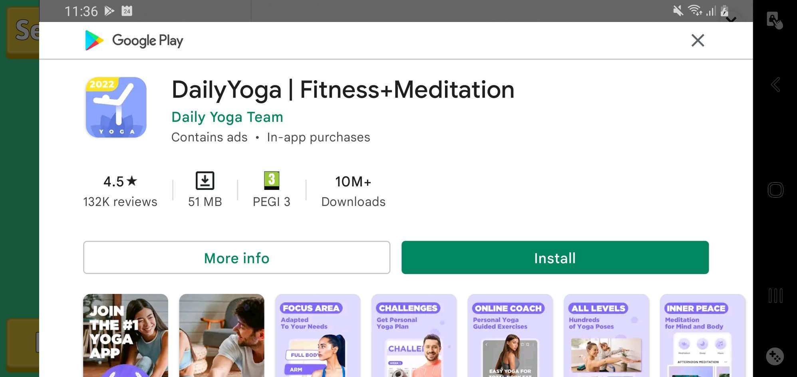
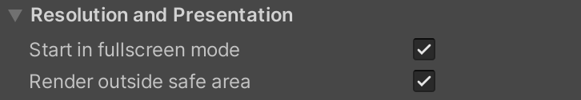
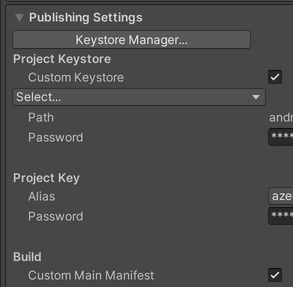

# Unity
## Import Azerion Unity package

- via `Assets-> Import Package -> Custom Package...` menu

## Configure AdMob App ID

- Open Azerion Ads configuration dialog via `AzerionAds -> Configuration` menu
- Enter AdMob App Id for `Android` and `iOS`

---
**NOTE**
During pre-build and post-build we check AdMob App Id configuration. So if you didn't configure it then during building
project plugin will throw exception in console and display the configuration dialog.
---

## Configure iOS Project

After exporting the iOS Xcode project you need to add `SKAdNetworkItems` key with `SKAdNetworkIdentifier` values. For
google AdMob it is `cstr6suwn9.skadnetwork` and you must have to add additional buyers identifier.

```html

<key>SKAdNetworkItems</key>
<array>
    <dict>
        <key>SKAdNetworkIdentifier</key>
        <string>cstr6suwn9.skadnetwork</string>
    </dict>
    <array>
```

## Dependency management

For dependency resolution we are using `External Dependency Manager for Unity(EDM4U)`.

### For Android dependency management

- Uncheck EDM4U `gradleTemplate.properties` patching
  from `Assets > External Dependency Manager > Android Resolver > Settings`
- Open the file `baseProjectTemplate.gradle` file in `Assets/Plugins/Android`. If you don't have such a file, go
  to `Project Settings->Publishing Settings` and enable the baseProjectTemplate gradle option.
- Add or merge the following section.

```config
    allprojects {
        ...
        repositories {
        google()
        jcenter()
        flatDir {
        dirs "${project(':unityLibrary').projectDir}/libs"
        }
        mavenCentral()
        maven { url "https://jitpack.io" }
        }
        }
```

- Add `mainTemplate.gradle`. Go to `Project Settings->Publishing Settings` and enable the mainTemplate gradle option.
- `Assets/Azerion/Ads/Editor/AzerionAdsDependencies.xml` file has already contains the necessary dependencies for
  Azerion android Ads SDK. If you need to add new one or change the version of an existing one, you can do there.

```config

<dependencies>
    <androidPackages>
        <androidPackage spec="com.google.android.gms:play-services-ads:20.3.0"/>
        <androidPackage spec="com.google.code.gson:gson:2.8.5"/>
        <androidPackage spec="io.reactivex.rxjava2:rxandroid:2.1.1"/>
        <androidPackage spec="io.reactivex.rxjava2:rxjava:2.2.19"/>
        <androidPackage spec="com.squareup.picasso:picasso:2.71828"/>
        <androidPackage spec="com.google.android.exoplayer:exoplayer-core:2.13.2"/>
        <androidPackage spec="com.google.android.exoplayer:exoplayer-ui:2.13.2"/>
        <androidPackage spec="com.google.android.exoplayer:extension-ima:2.13.2"/>
        <androidPackage spec="com.google.android.gms:play-services-ads-identifier:17.0.0"/>
        <androidPackage spec="com.google.android.gms:play-services-location:17.0.0"/>
        <androidPackage spec="com.android.installreferrer:installreferrer:2.1"/>
    </androidPackages>
    <iosPods>
        ...
    </iosPods>

</dependencies>
```

### iOS Dependency Management

Install cocoapods in your Mac using following command:

`$ sudo gem install cocoapods`

Enable cocoapods integration from

`Assets --> External Dependency Management --> iOS Resolver --> Settings`

Update the `AzerionAdsDependencies.xml` file with required third party dependencies if needed.

```config
<dependencies>
    <androidPackages>
        ...
    </androidPackages>
    <iosPods>
        <iosPod name="Google-Mobile-Ads-SDK" version="~> 8.8.0" bitcodeEnabled="true"
                minTargetSdk="6.0" addToAllTargets="false" />
        <iosPod name="GoogleAds-IMA-iOS-SDK" version="~> 3.14.3" bitcodeEnabled="true"
                minTargetSdk="6.0" addToAllTargets="false" />
    </iosPods>

</dependencies>
```
## Create the SDK default ad config

### Android

At runtime SDK downloads the ad configuration for the app based on the`Package Name`. You can create a offline default
ad configuration file for the app via `AzerionAds -> Configuration -> Android -> Create configuration` options. What it
does that behind the scene it download the current snapshot of the SDK config for this app from backend and
create the `default_azerion_sdk_config.json` file in `/Assets/Azerion/Ads/Editor/Configuration/Android` directory. Whenever SDK
failed to fetch the ad configuration from backend it will use the offline default ad config for ad serving.<br>

### iOS

Same for iOS, SDK downloads the ad configuration for the app based on the`Bundle Identifier`. You can create a offline default
ad configuration file for the app via `AzerionAds -> Configuration -> iOS -> Create configuration` options. It
creates the `default_azerion_sdk_config.json` file in `/Assets/Azerion/Ads/Editor/Configuration/iOS` directory.<br>


## Initialize Azerion Ads SDK

```c#
public class AzerionAdsController : MonoBehaviour
{
    // Start is called before the first frame update
    void Start()
    {
        // Initialize the Azerion Ads SDK.
        var settings = new Settings(withUserConsent:false, gdprConsentString:"", isCoppaCompliant:false, isTestModeEnabled:true, isDebugModeEnabled:true);
        Debug.Log("Start Initializing the Azerion Ads SDK");
        AzerionAds.Initialize(HandleInitCompleteAction, settings);
    }

    private void HandleInitCompleteAction(InitializationStatus initializationStatus)
    {
        // ImproveDigital, AdMob adapters status
        foreach (KeyValuePair<string, AdapterStatus> adapterStateEntry in initializationStatus.getAdapterStatusMap())
        {
            Debug.Log("AdapterName: " + adapterStateEntry.Value.Name + " AdapterStatus: " +
                      adapterStateEntry.Value.InitializationState);
        }
    }
    ...
  }
```

---
**NOTE**
You can only request Ad after SDK successfully finished initialization.
---

## Banner Ad

```c#
public class AzerionAdsController : MonoBehaviour
{
  private BannerAd _bannerAd;
  ...
  private void RequestBannerAd()
    {
        var adUnitId = "22358747";
        _bannerAd?.Destroy();

        // Create a Smart banner at bottom of the screen
        _bannerAd = new BannerAd(adUnitId, AdSize.BANNER, AdPosition.Bottom);

        // Add Event Handlers
        _bannerAd.OnAdLoaded += (sender, args) =>
        {
            Debug.Log("Ad Loaded");
            // Show the banner ad 
            _bannerAd?.Show();
        };
        _bannerAd.OnAdFailedToLoad += (sender, args) =>
        {
            Debug.Log("errorCode: " + args.ErrorCode + " message: " + args.Message + " errorContext: " +
                      args.ErrorContext);
        };
        _bannerAd.OnAdClosed += (sender, args) => { Debug.Log("OnAdClosed"); };
        _bannerAd.OnAdDisplayed += (sender, args) => { Debug.Log("Ad Displayed"); };
        _bannerAd.OnAdFailedToDisplay += (sender, args) =>
        {
            Debug.Log("errorCode: " + args.ErrorCode + " message: " + args.Message + " errorContext: " +
                      args.ErrorContext);
        };

        _bannerAd.OnAdHide += (sender, args) => { Debug.Log("OnAdHide"); };

        _bannerAd.OnAdLeftApplication += (sender, args) => { Debug.Log("OnAdLeavingApplication"); };

        // Load a banner ad
        _bannerAd.LoadAd();
    }
    ...
}
```

## Interstitial Ad

```c#
public class AzerionAdsController : MonoBehaviour
{
    private InterstitialAd _interstitialAd;
    ...
    private void RequestInterstitialAd()
    {
        string vastAdUnitId = "22328044";
        string staticAdUnitId = "22371036";
        _interstitialAd?.Destroy();
    
        _interstitialAd = new InterstitialAd(vastAdUnitId, staticAdUnitId);
        // Add Event Handlers
        _interstitialAd.OnAdLoaded += (sender, args) =>
        {
            Debug.Log("Ad Loaded");
            _interstitialAd?.Show();
        };
        _interstitialAd.OnAdFailedToLoad += (sender, args) =>
        {
            Debug.Log("errorCode: " + args.ErrorCode + " message: " + args.Message + " errorContext: " +
                      args.ErrorContext);
        };
        _interstitialAd.OnAdClosed += (sender, args) =>
        {
            Debug.Log("OnAdClosed");
        };
        _interstitialAd.OnAdDisplayed += (sender, args) => { Debug.Log("Ad Displayed"); };
        _interstitialAd.OnAdFailedToDisplay += (sender, args) =>
        {
            Debug.Log("errorCode: " + args.ErrorCode + " message: " + args.Message + " errorContext: " +
                      args.ErrorContext);
        };
        _interstitialAd.OnAdLeavingApplication += (sender, args) => { Debug.Log("OnAdLeavingApplication"); };
    
        Debug.Log("Load Interstitial Ad");
        _interstitialAd.Load();
    }
    ...
}
```

---
**NOTE**
ImproveDigital first try to fill the interstitial placement with video ad if no video ad is available then it try to
fill it with static interstitial. Fot this reason we are taking two Ad Unit Ids.
---

## Rewarded Ad

```c#
public class AzerionAdsController : MonoBehaviour
{
    private RewardedAd _rewardedAd;
    ...
    private void RequestRewardedAd()
    {
        string adUnityId = "22328044";
        _rewardedAd?.Destroy();
        _rewardedAd = new RewardedAd(adUnityId);
        // Add Event Handlers
        _rewardedAd.OnAdLoaded += (sender, args) =>
        {
            Debug.Log("Ad Loaded");
            _rewardedAd?.Show();
        };
        _rewardedAd.OnAdFailedToLoad += (sender, args) =>
        {
            Debug.Log("errorCode: " + args.ErrorCode + " message: " + args.Message + " errorContext: " +
                      args.ErrorContext);
        };
        _rewardedAd.OnAdClosed += (sender, args) =>
        {
            Debug.Log("OnAdClosed");
        };
        _rewardedAd.OnAdDisplayed += (sender, args) => { Debug.Log("Ad Displayed"); };
        _rewardedAd.OnAdFailedToDisplay += (sender, args) =>
        {
            Debug.Log("errorCode: " + args.ErrorCode + " message: " + args.Message + " errorContext: " +
                      args.ErrorContext);
        };
        _rewardedAd.OnAdLeavingApplication += (sender, args) => { Debug.Log("OnAdLeavingApplication"); };
        _rewardedAd.OnUserRewardEarned += (sender, args) =>
        {
            if (args != null)
            {
                Debug.Log("OnUserRewardEarned reward amount: " + args.Amount);
            }
            else
            {
                Debug.Log("OnUserRewardEarned");
            }
        };
        _rewardedAd.Load();
    }
    ...
}
```
#AdMob FullScreen Ad Scaling Issue on Android


If you use the following `resolution and presentation` setting in your game then you may face the above problem, because by default AdMob use `Translucent` theme for it's `AdActivity` which allow see through.<br/><br/>


To solve this problem you have to override the `Translucent` behaviour of the `AdActivity`
Here are the steps you need to follow
- Add `Custom Main Manifest` <br/><br/>
  
   <br/><br/>

- Override `Translucent` behaviour of the `AdActivity`
```config
<manifest package="com.unity3d.player" xmlns:android="http://schemas.android.com/apk/res/android" xmlns:tools="http://schemas.android.com/tools">
  ...
  <application>
    ...
    <activity
                android:name="com.google.android.gms.ads.AdActivity"
                android:theme="@android:style/Theme.NoTitleBar.Fullscreen"
                tools:replace="android:theme" />
    ..
  </application>
</manifest>
```
# Android platform

## Add library AAR files into project
Android SDK stack has two AAR artifacts `azerion-sdk-ads-core-x.x.x.aar` and `azerion-sdk-ads-mediation-admob-1.0.0.aar`.
If you want to integrate both `ImproveDigital` and `AdMob` ad networks then you will have to add both these artifacts otherwise only ad `azerion-sdk-ads-core-x.x.x.aar`.

Currently we are not publishing our artifacts on public repo like maven central, so you will have to add those manually. 

Copy Azerion Ads library `AAR` files into your `libs` folder.<br>
<br>
Also add the corresponding dependencies into your app's  `build.gradle`.
```
dependencies {
    ...
    implementation(name: 'azerion-sdk-ads-core-1.0.0', ext:'aar')
    implementation(name: 'azerion-sdk-ads-mediation-admob-1.0.0', ext:'aar')
    ...
}
```

## Add AdMob App Id
Add your AdMob app ID (identified in the AdMob UI) to your app's AndroidManifest.xml file.
```xml
<manifest>
    <application>
        <meta-data
            android:name="com.google.android.gms.ads.APPLICATION_ID"
            android:value="ca-app-pub-xxxxxxxxxxxxxxxx~yyyyyyyyyy"/>
    </application>
</manifest>
```

## Initialize Ads SDK
App developer should get the user consent for EU ePrivacy Directive and the General Data Protection Regulation (GDPR).
```Java
public class MainActivity extends AppCompatActivity {
    ...
    @Override
    protected void onCreate(Bundle savedInstanceState) {
        ...
        Settings settings = new Settings();
        settings.setWithUserConsent(true);
        settings.setCOPPACompliant(false);
        settings.setGdprConsentString("GdprConsentString");
        // For debug log
        settings.setDebugModeEnabled(false);
        // In test mode SDK will use AdMob test AdUnit IDs.
        // If you want to test with real Ad make this settings false
        // and add your device as a test device in your AdMob account.
        settings.setTestModeEnabled(false);
        AzerionAds.initialize(this, settings, new OnAzerionAdsInitializationCompleted() {
            @Override
            public void onInitializationCompleted(InitializationStatus status) {

            }

        });
        ...
    }
    ...
}
```
---
**NOTE** 
You can load ad after successfull initialization.
---
## Banner Ad
- Add the `BannerAdView` into app layout. 
  - Via layout xml 
```xml
<?xml version="1.0" encoding="utf-8"?>
<androidx.constraintlayout.widget.ConstraintLayout xmlns:android="http://schemas.android.com/apk/res/android"
    xmlns:app="http://schemas.android.com/apk/res-auto"
    xmlns:tools="http://schemas.android.com/tools"
    android:layout_width="match_parent"
    android:layout_height="match_parent">
    ...
    <com.azerion.sdk.ads.core.banner.BannerAdView
        android:id="@+id/adView"
        android:layout_width="wrap_content"
        android:layout_height="wrap_content"
        android:visibility="invisible"
        app:layout_constraintBottom_toBottomOf="parent"
        app:layout_constraintStart_toStartOf="parent"
        app:layout_constraintEnd_toEndOf="parent"
        app:adSize="BANNER"
        app:placementId="22358747" />
        ...
</androidx.constraintlayout.widget.ConstraintLayout>
```
``` Java
public class BannerFragment extends Fragment {
    ...
    @Override
    public View onCreateView(LayoutInflater inflater, ViewGroup container,
                             Bundle savedInstanceState) {
        ConstraintLayout view = (ConstraintLayout) inflater.inflate(R.layout.fragment_improve_digital_banner, container, false);
        ...
        bannerAdView = (BannerAdView) constraintLayout.findViewById(R.id.adView);
        bannerAdView.setBannerAdEventListener(new BannerAdView.BannerAdEventListener() {
        @Override
        public void onAdDisplayed(BannerAdView bannerAdView) {}

        @Override
        public void onAdLoaded(BannerAdView bannerAdView) {}

        @Override
        public void onAdFailedToLoad(BannerAdView bannerAdView, AzerionAdsError azerionAdsError) {}

        @Override
        public void onAdFailedToDisplay(BannerAdView bannerAdView, AzerionAdsError azerionAdsError) {}

        @Override
        public void onAdClosed(BannerAdView bannerAdView) {}

        @Override
        public void onAdLeftApplication(BannerAdView bannerAdView) {}
    });
    }
```
  - Programmatically
``` Java
public class BannerFragment extends Fragment {
    ...
    @Override
    public View onCreateView(LayoutInflater inflater, ViewGroup container,
                             Bundle savedInstanceState) {
        ...
        ConstraintLayout view = (ConstraintLayout) inflater.inflate(R.layout.fragment_improve_digital_banner, container, false);
        ...
        bannerAdView = new BannerAdView(getContext());
        bannerAdView.setAdUnitId("22358747");
        bannerAdView.setBannerAdSize(BannerAdSize.BANNER);
        bannerAdView.setBannerAdEventListener(new BannerAdView.BannerAdEventListener() {
            @Override
            public void onAdDisplayed(BannerAdView bannerAdView) {}

            @Override
            public void onAdLoaded(BannerAdView bannerAdView) {}

            @Override
            public void onAdFailedToLoad(BannerAdView bannerAdView, AzerionAdsError azerionAdsError) {}

            @Override
            public void onAdFailedToDisplay(BannerAdView bannerAdView, AzerionAdsError azerionAdsError) {}

            @Override
            public void onAdClosed(BannerAdView bannerAdView) {}

            @Override
            public void onAdLeftApplication(BannerAdView bannerAdView) {}
        });
        ConstraintLayout.LayoutParams layoutParams = new ConstraintLayout.LayoutParams(ViewGroup.LayoutParams.WRAP_CONTENT, ViewGroup.LayoutParams.WRAP_CONTENT);
        layoutParams.startToStart = ConstraintLayout.LayoutParams.PARENT_ID;
        layoutParams.endToEnd = ConstraintLayout.LayoutParams.PARENT_ID;
        layoutParams.bottomToBottom = ConstraintLayout.LayoutParams.PARENT_ID;
        constraintLayout.addView(bannerAdView, layoutParams);
    }
    ...
}
```
 - Load Banner Ad
 ```Java
 bannerAdView.loadAd();
 ```
  - Destroy : when you longer needed the BannerAdView it's better to destroy it for avoding memory leak.
```Java
bannerAdView.destroy();
```

## Interstitial Ad

```Java
interstitialAd = new InterstitialAd(vastAdUnitId, staticAdUnitId, new InterstitialAdListener() {
    @Override
    public void onAdLoaded() {
        Log.d(TAG, "Ad loaded");
        interstitialAd.show();
    }

    @Override
    public void onAdFailedToLoad(AzerionAdsError azerionAdsError) {
        Log.d(TAG, "Ad failed to load with message: " + azerionAdsError.getMessage());
    }

    @Override
    public void onAdFailedToDisplay(AzerionAdsError azerionAdsError) {
        Log.d(TAG, "Ad failed to load with message: " + azerionAdsError.getMessage());
    }

    @Override
    public void onAdLeftApplication() {
        Log.d(TAG, "onAdLeftApplication");
    }

    @Override
    public void onAdClosed() {
        Log.d(TAG, "Ad closed");
    }

    @Override
    public void onAdDisplayed() {
        Log.d(TAG, "Ad displayed");
    }
});
interstitialAd.load(getActivity());
```
Destroy the Ad when you longer needed it via 
```Java
interstitialAd.destroy();
```
---
NOTE : ImproveDigital first try to fill the interstitial placement with video ad if no video ad is available then it try to fill it with static interstitial. Fot this reason we are taking two Ad Unit Ids.
---

## Rewarded Ad
```Java
rewardedVideoAd = new RewardedVideoAd(adUnitId, new RewardedVideoAdListener() {
            @Override
            public void onAdLoaded() {
                rewardedVideoAd.show(getActivity());
            }

            @Override
            public void onAdFailedToLoad(AzerionAdsError azerionAdsError) {
                Log.d(TAG, "Ad failed to load with message: " + azerionAdsError.getMessage(), Toast.LENGTH_LONG).show();
            }

            @Override
            public void onAdFailedToDisplay(AzerionAdsError azerionAdsError) {
                Log.d(TAG, "Ad failed to display with message: " + azerionAdsError.getMessage(), Toast.LENGTH_LONG).show();
            }

            @Override
            public void onUserRewardEarned(RewardItem rewardItem) {
                Log.d(TAG, "Reward earned!", Toast.LENGTH_LONG).show();
            }
        });
rewardedVideoAd.load(getActivity());

```
Destroy the Ad when you longer needed it via 
```Java
rewardedVideoAd.destroy();
```

# iOS platform
## Automatic integration
Currently we are not supporting any Automatic integration using cocoapods or carthage.
## Manual integration
Drag and drop the `AzerionAds.framework` and `AzerionAdsResources.bundle` file in your xcode project. Add `AzerionAds.framework` as a Embeded framework. If you want to show AdMob ads then you need to integrate AdMob frameworks also. You can do that either by adding the frameworks manually or by using cocoapods. You will found complete instructions of adding AdMob here:
[AdMob integration in xcode project](https://developers.google.com/admob/ios/quick-start)

## Initialize AzerionAds SDK
App developer should get the user consent for EU ePrivacy Directive and the General Data Protection Regulation (GDPR).
```objective-c
- (BOOL)application:(UIApplication *)application didFinishLaunchingWithOptions:(NSDictionary *)launchOptions {
    AZASettings *settings = [[AZASettings alloc] init];
    settings.withUserConsent = true;
    settings.isCOPPACompliant = true;
    settings.gdprConsentString = @"GdprConsentString";
    [AzerionAds initializeWithSettings:settings withInitializationStatusHandler:^(AZAInitializtionStatus * _Nonnull status) {
        
    }];
    return YES;
}
```
---
**NOTE** 
You can load ad after successfull initialization.
---
## Banner Ad
### Using Storyboard
Add an UIView as a subview and assign `AZABannerView` as class of that view from Identity Inspector. Add outlet for the banner view
```objective-c
@property (retain, nonatomic) IBOutlet AZABannerView *bannerView;
```
```objective-c
    self.bannerView.adUnitId = @"YOUR_BANNER_AD_UNIT_ID_HERE"
    self.bannerView.adSize = kAZASizeFullBanner;
    self.bannerView.rootViewController = self;
    self.bannerView.delegate = self;
```
### Programmatically
```objective-c
    self.bannerView = [[AZABannerView alloc] initWithAdSize:kAZASizeFullBanner];
    self.bannerView.adUnitId = @"YOUR_BANNER_AD_UNIT_ID_HERE"
    self.bannerView.rootViewController = self;
    self.bannerView.delegate = self;
```
Implement AZABannerViewDelegate delegates
```objective-c
- (void)bannerViewDidReceiveAd:(AZABannerView *)bannerView {
    
}
- (void)bannerView:(AZABannerView *)bannerView didFailToReceiveAdWithError:(AZAAdError *)error {
    
}
- (void)bannerViewDidRecordImpression:(AZABannerView *)bannerView {
    
}

- (void)bannerViewDidLeftApplication:(AZABannerView *)bannerView {
    
}

- (void)didOpenedBannerView:(AZABannerView *)bannerView {
    
}
```
Load Banner Ad
```objective-c
[self.bannerView loadAd];
```
## Interstitial Ad
```objective-c
self.interstitialAd = [[AZAInterstitialAd alloc] initWithVideoAdUnitId:@"YOUR_INTERSTITIAL_VIDEO_AD_UNIT_ID_HERE" withStaticAdUnitId:@"YOUR_INTERSTITIAL_STATIC_AD_UNIT_ID_HERE"];
self.interstitialAd.delegate = self;
```
Implement AZAInterstitialAdDelegate delegates
```objective-c
-(void)onLoadAd:(AZAInterstitialAd *)ad {

}
-(void)onFailedToLoadAd:(AZAInterstitialAd *)ad withError:(AZAAdError *)error {

}
-(void)onClickedAd:(AZAInterstitialAd *)ad {

}
-(void)onDisplayedAd:(AZAInterstitialAd *)ad {

}
-(void)onFailedToDisplayAd:(AZAInterstitialAd *)ad withError:(AZAAdError *)error {

}
-(void)onAdImpression:(AZAInterstitialAd *)ad {

}
-(void)onClosedAd:(AZAInterstitialAd *)ad {

}
```
Load interstitial ad
```objective-c
[self.interstitialAd loadAd];
```
Show interstitial ad
```objective-c
[self.interstitialAd presentFromRootViewController:viewController];
```
## Rewarded Ad
```objective-c
self.rewardedAd = [[AZARewardedAd alloc] initWithAdUnitId:placementId delegate:delegate];
self.rewardedAd.delegate = self;
```
Implement AZARewardedAdDelegate delegates
```objective-c
-(void)onLoadRewardedAd:(AZARewardedAd *)ad {
    
}
-(void)onFailedToLoadRewardedAd:(AZARewardedAd *)ad withError:(AZAAdError *)error {

}
-(void)onDisplayedRewardedAd:(AZARewardedAd *)ad {

}
-(void)onFailedToDisplayRewardedAd:(AZARewardedAd *)ad withError:(AZAAdError *)error {

}
-(void)onDismissRewardedAd:(AZARewardedAd *)ad {

}
-(void)onRewardEarned:(AZARewardedAd *)ad rewardItem:(AZARewardItem *)rewardItem {

}
```
Load rewarded ad
```objective-c
[self.rewardedAd loadAd];
```
Show rewarded ad
```objective-c
[self.rewardedAd presentFromRootViewController:viewController];
```